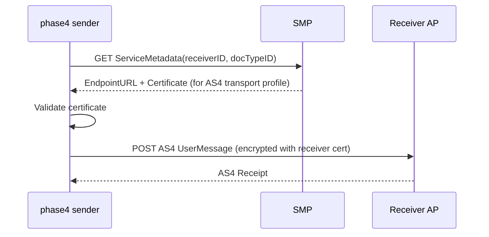

**Package:** `com.helger.phase4.dynamicdiscovery`  
**Maven artifact:** `com.helger.phase4:phase4-dynamic-discovery`

Service Metadata Publishers (SMPs) provide the link between a participant identifier and their AS4 endpoint URL and certificate. phase4 integrates SMP lookup via implementations of `IAS4EndpointDetailProvider`.

## How SMP lookup works



1. The sender calls `endpointDetailProvider.init(docTypeID, processID, receiverID)` immediately before sending.
2. The provider queries the SMP for service metadata.
3. The provider filters for the configured `ISMPTransportProfile` (e.g. `TRANSPORT_PROFILE_PEPPOL_AS4_V2`).
4. The receiver's AP certificate and endpoint URL are extracted from the result.
5. The certificate is optionally validated against a CA trust store.
6. The AS4 message is sent to the resolved URL, encrypted with the resolved certificate.

Results are cached for the lifetime of the provider instance.

## Supported SMP types

| Class | SMP standard | Used by |
|---|---|---|
| `AS4EndpointDetailProviderPeppol` | Peppol SMP (OASIS BDX) | Peppol |
| `AS4EndpointDetailProviderBDXR` | OASIS BDXR SMP v1 | CEF, EUDAMED |
| `AS4EndpointDetailProviderBDXR2` | OASIS BDXR SMP v2 | CEF v2 |
| `AS4EndpointDetailProviderConstant` | Static (no SMP) | Testing, known endpoints |

## AS4EndpointDetailProviderPeppol configuration

### Create from a SMPClientReadOnly

```java
import com.helger.phase4.dynamicdiscovery.AS4EndpointDetailProviderPeppol;
import com.helger.smpclient.peppol.SMPClientReadOnly;
import com.helger.smpclient.url.PeppolNaptrURLProvider;

// Build SMP client targeting the Peppol production SML
SMPClientReadOnly smpClient = new SMPClientReadOnly(
    PeppolNaptrURLProvider.INSTANCE,
    receiverParticipantID,   // participant ID of the receiver
    ESML.DIGIT_PRODUCTION    // or ESML.DIGIT_TEST for test
);

// Create the provider (caches the result after first init() call)
IAS4EndpointDetailProvider provider = AS4EndpointDetailProviderPeppol.create(smpClient);
```

### Override transport profile

```java
import com.helger.peppol.smp.ESMPTransportProfile;

AS4EndpointDetailProviderPeppol provider = AS4EndpointDetailProviderPeppol.create(smpClient);
provider.setTransportProfile(ESMPTransportProfile.TRANSPORT_PROFILE_PEPPOL_AS4_V2);
```

Default transport profile: `ESMPTransportProfile.TRANSPORT_PROFILE_PEPPOL_AS4_V2`.

### Low-level constructor

If you need separate `ISMPServiceGroupProvider` and `ISMPExtendedServiceMetadataProvider` instances:

```java
new AS4EndpointDetailProviderPeppol(
    ISMPServiceGroupProvider aServiceGroupProvider,
    ISMPExtendedServiceMetadataProvider aServiceMetadataProvider
)
```

## Phase4SMPException

`Phase4SMPException` is thrown by all SMP-based providers when an SMP lookup fails. It extends `Phase4Exception`.

```java
public class Phase4SMPException extends Phase4Exception {
    // isRetryFeasible() indicates whether a retry may succeed
}
```

| `isRetryFeasible()` | Cause |
|---|---|
| `true` | Transient network failure, bad request, bad response, unauthorized |
| `false` | Endpoint not found or structural error |

### Error handling example

```java
import com.helger.phase4.dynamicdiscovery.Phase4SMPException;
import com.helger.phase4.util.Phase4Exception;

try {
    EAS4UserMessageSendResult result = Phase4PeppolSender.builder()
        // ... builder configuration ...
        .sendMessageAndCheckForReceipt();

    if (!result.isSuccess()) {
        LOGGER.error("AS4 send failed: " + result.getID());
    }
} catch (Phase4SMPException ex) {
    LOGGER.error("SMP lookup failed", ex);
    if (ex.isRetryFeasible()) {
        // schedule retry
    }
} catch (Phase4Exception ex) {
    LOGGER.error("AS4 error", ex);
}
```

## SMP integration in profile senders

Profile-specific senders integrate SMP lookup via dedicated convenience methods:

<Tabs>
  <Tab title="Peppol">
    ```java
    Phase4PeppolSender.builder()
        .smpClient(smpClient);  // internally creates AS4EndpointDetailProviderPeppol
    ```
  </Tab>
  <Tab title="CEF">
    ```java
    Phase4CEFSender.builder()
        .smpClient(bdxrV1Client);  // AS4EndpointDetailProviderBDXR
        // or:
        .smpClient(bdxrV2Client);  // AS4EndpointDetailProviderBDXR2
    ```
  </Tab>
  <Tab title="Generic">
    ```java
    // Any sender builder that extends AbstractAS4UserMessageBuilder
    builder.endpointDetailProvider(myProvider);
    ```
  </Tab>
</Tabs>

## Static endpoint (no SMP)

For testing or when the endpoint is known in advance:

```java
import com.helger.phase4.dynamicdiscovery.AS4EndpointDetailProviderConstant;

IAS4EndpointDetailProvider provider = new AS4EndpointDetailProviderConstant(
    receiverX509Certificate,
    "https://test-receiver.example.com/as4"
);

// Or in a Peppol builder:
builder.receiverEndpointDetails(receiverCert, "https://test-receiver.example.com/as4");
```
